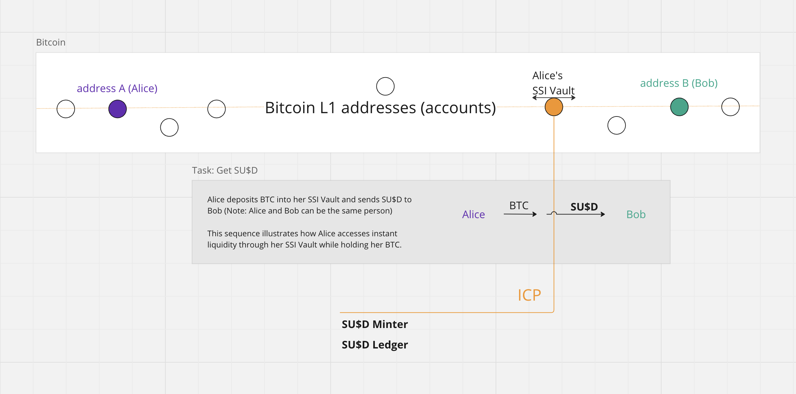
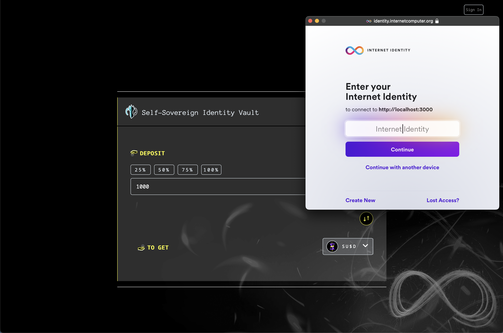

# Basic Bitcoin with Syron 

## Overview

This tutorial is a work in progress. When completed, it will guide you through deploying a sample SSI Vault to acquire Syron U$ dollars (SU$D) on Bitcoin using the Internet Computer, featuring a https://github.com/dfinity/examples/tree/master/rust/basic_bitcoin[Basic Bitcoin Example].

## Architecture

The architecture of Syron includes:

- **Syron U$ Dollar (SU$D)**: A stablecoin pegged to USD, minted by over-collateralizing Bitcoin in Self-Sovereign Identity (SSI) Vaults.
- **Self-Sovereign Identity (SSI) Vaults**: Hold BTC collateral and manage SU$D minting/burning.
- **Integration with Bitcoin**: Utilizes ICP for seamless integration with Bitcoin network, enabling verification of BTC collateral and transaction management.
- **Internet Computer Protocol (ICP)**: Facilitates smart contract execution and interoperability.
- **ckBTC and Elliptic DAO Protocol**: Foundation providing open-source software and reusable features.
- **Juno Integration**: Enhances user experience with user-controlled SSI Vaults. See https://github.com/txalkan/susd/tree/feat/syron-icp[SSI Browser].

This architecture ensures easy access to USD liquidity while retaining BTC ownership, fostering a permissionless system with enhanced security and interoperability within the Bitcoin DeFi ecosystem.
